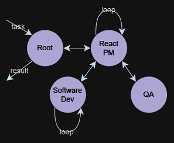
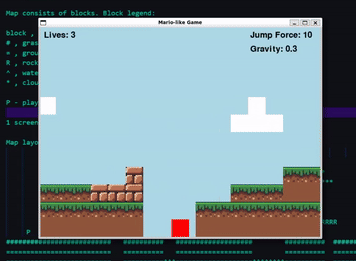
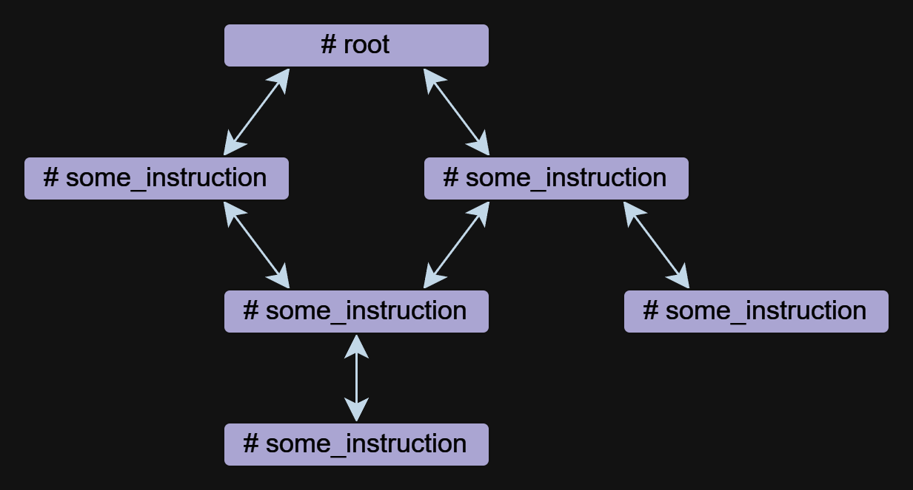

# 🔮 Mentals AI

Mentals AI is a tool designed for creating and operating agents that feature **`loops`**, **`memory`**, and various **`tools`**, all through straightforward **`markdown`** file with a .gen extension. Think of an agent file as an executable file. You focus entirely on the logic of the agent, eliminating the necessity to write scaffolding code in Python or any other language. Essentially, it redefines the foundational frameworks for future AI applications.

> [!NOTE] 
> [work in progress] A local vector database to store your chats with the agents as well as your private > information.

- [Getting Started](#-getting-started)
- [Differences from Other Frameworks](#-differences-from-other-frameworks)
- [Key Concepts](#️-key-concepts)
    - [Instruction (prompt)](#-instruction-prompt)
    - [Working Memory (context)](#-working-memory-context)
    - [Short-Term Memory (experimental)](#-short-term-memory-experimental)
    - [Control flow: From strings to algorithms](#️-control-flow-from-strings-to-algorithms)
- [Roadmap](#️-roadmap)
- [The Idea](#-the-idea)

## 📌 Examples

Word chain game in a self-loop controlled by LLM:


> NLOP — Natural Language Operation

Or more complex use cases:
| 🔄 Any multi-agent interactions | 👾 Space Invaders generator agent | 🍄 2D platformer generator agent |
|--------------------|-----------|--------------|
| |  |  |

Or help with the content:
- Collect YouTube videos on a given topic and save to a .csv file with the videos, views, channel name, and link;
- Get the transcription from the video and create a table of contents;
- Take top news from Hacker News, choose a topic and write an article on the topic with the participation of the critic and save to a file.

All of the above examples are located in the [agents](agents) folder.

> [!NOTE]
> Llama3 support is available for providers using a compatible OpenAI API.

## 🚀 Getting Started

Begin by securing an OpenAI API key through the creation of an  [OpenAI
account](https://platform.openai.com/docs/quickstart?context=node). If you already have 
an API key, skip this step.

### 🏗️ Build and run

**Prerequisites**

Before building the project, ensure the following dependencies are installed:

- `libcurl`: Used for making HTTP requests
- `libfmt`: Provides an API for formatting

Depending on your operating system, you can install these using the following commands:

**Linux**

```shell
sudo apt-get update
sudo apt-get install libcurl4-openssl-dev libfmt-dev
```

**macOS**

```shell
brew update
brew install curl fmt
```

**Windows**

For Windows, it's recommended to use vcpkg or a similar package manager:

```shell
vcpkg install curl fmt
```

**Clone the repository**
```shell
git clone https://github.com/turing-machines/mentals-ai
cd mentals-ai
```

**Configuration**

Place your API key in the `config.toml` file:

```bash
# OpenAI
API_KEY = "insert API key here"
ENDPOINT = "https://api.openai.com/v1"
MODEL = "gpt-4o"
```

**Build the project**

```bash
make
```

**Run**

```shell
./build/mentals agents/loop.gen -d
```

## 🆚 Differences from Other Frameworks

Mentals AI distinguishes itself from other frameworks in three significant ways:

* The `Agent Executor` 🧠 operates through a recursive loop. The LLM determines the next steps: selecting instructions (prompts) and managing data based on previous loops. This recursive decision-making process is integral to our system, outlined in [mentals_system.prompt](mentals_system.prompt)
* Agents of any complexity can be created using `Markdown`, eliminating the need for traditional programming languages. However, Python can be integrated directly into the agent's `Markdown` script if necessary.
* Unlike platforms that include preset reasoning frameworks, Mentals AI serves as a blank canvas. It enables the creation and integration of your own reasoning frameworks,  including existing ones: `Tree of Thoughts`, `ReAct`, `Self-Discovery`, `Auto-CoT`, and others. One can also link these frameworks together into more complex sequences, even creating a network of various reasoning frameworks.

## 🗝️ Key Concepts

The agent file is a textual description of the agent instructions with a `.gen` extension.

### 📖 Instruction (prompt)

Instruction is the basic component of an agent in Mentals. An agent can consist of one or more instructions, which can refer to each other. 



Instructions can be written in free form, but they always have a name that starts with the `#` symbol. The `## use:` directive is used to specify a reference to other instructions. Multiple references are listed separated by commas.

Below is an example with two instructions `root` and `meme_explain` with a reference:

```
# root
## use: meme_explain

1. Create 3 memes about AGI;
2. Then do meme explain with meme per call;
3. Output memes and their explanations in a list.

# meme_explain

Explain the gist of the meme in 20 words in medieval style.
Return explanation.
```

In this example, the `root` instruction calls the `meme_explain` instruction. The response from meme_explain is then returned to the instruction from which it was called, namely the root.

An instruction can take an `input` parameter, which is automatically generated based on the context when the instruction is called. To specify the input data more precisely, you can use a *free-form prompt* in the `## input:` directive, such as a JSON object or `null`.

Using a document for input:
```
# some_instruction
## input: design document only
```

Using a JSON object as input:
```
# duckduckgo
## input: { search_query: search query, search_limit: search limit }

Write a Python script to search in DuckDuckGo.
Simulate request headers correctly e.g. user-agent as Mozilla and Linux.
```

> [!NOTE]
> Instruction calls are implemented independently from function or tool calls at OpenAI, enabling the operation of agents with models like Llama3. The implementation of instruction calls is transparent and included in the mentals_system.prompt file.

#### 🛠️ Tool

Tool is a kind of instruction. Mentals has a set of native tools to handle message output, user input, file handling, Python interpreter, Bash commands, and Short-term memory.

Ask user example:
```
# root
## use: user_input

Ask user name.
Then output: `Welcome, user_name!`
```

File handling example:
```
# root
## use: write_file, read_file

Write 'Hello world' to a file.
Then read and output file content.
```

The full list of native tools is listed in the file `native_tools.toml`.


### 🧠 Working Memory (context)

Each instruction has its own working memory — context. When exiting an instruction and re-entering it, the context is kept by default. To clear the context when exiting an instruction, you can use the `## keep_context: false` directive:

```
# meme_explain
## keep_context: false

Explain the gist of the meme in 20 words in medieval style.
Return explanation.
```

By default, the size of the instruction context is not limited. To limit the context, there is a directive `## max_context: number` which specifies that only the `number` of the most recent messages should be stored. Older messages will be pushed out of the context. This feature is useful when you want to keep the most recent data in context so that older data does not affect the chain of reasoning.

```
# python_code_generation
## input: development tasks in a list
## use: write_file
## max_context: 5

Do all development tasks in a loop: task by task.
Save the Python code you implement in the main.py file.
```

### ⏳ Short-Term Memory (experimental)

Short-term memory allows for the storage of intermediate results from an agent's activities, which can then be used for further reasoning. The contents of this memory are accessible across all instruction contexts.

The `memory` tool is used to store data. When data is stored, a keyword and a description of the content are generated. In the example below, the `meme_recall` instruction is aware of the meme because it was previously stored in memory.

```
# root
## use: memory, meme_recall

Come up with and memorize a meme.
Call meme recall.

# meme_recall
## input: nothing

What the meme was about?
```

### ⚙️ Control flow: From strings to algorithms

The control flow, which includes conditions, instruction calls, and loops (such as `ReAct`, `Auto-CoT`, etc.), is fully expressed in natural language. This method enables the creation of `semantic conditions` that direct data stream branching. For instance, you can request an agent to autonomously play a word chain game in a loop or establish an ambiguous exit condition: `exit the loop if you are satisfied with the result`. Here, the language model and its context determine whether to continue or stop. All this is achieved without needing to define flow logic in Python or any other programming languages.

#### ⚖️ Reason Action (ReAct) example

```
## use: execute_bash_command, software_development, quality_assurance

...
You run in a loop of "Thought", "Action", "Observation".
At the end of the loop return with the final answer.
Use "Thought" to describe your thoughts about the task 
you have been asked. Use "Action" to run one of the actions 
available to you. Output action as: "Action: action name to call".
"Observation" will be the result of running those actions.

Your available actions:
- `execute_bash_command` for util purposes e.g. make directory, install packages, etc.;
- `software_development` for software development and bug fixing purposes;
- `quality_assurance` for QA testing purposes.
...
```

#### 🌳 Tree of Thoughts (ToT) example

The idea behind ToT is to generate multiple ideas to solve a problem and then evaluate their value. 
Valuable ideas are kept and developed, other ideas are discarded.

Let's take the example of the 24 game. The 24 puzzle is an arithmetical puzzle in which 
the objective is to find a way to manipulate four integers so that the end result is 24.
First, we define the instruction that creates and manipulates the tree data structure. 
The model knows what a tree is and can represent it in any format, from plain text to XML/JSON or any custom format.

In this example, we will use the plain text format:

```
# tree
## input: e.g. "add to node `A` child nodes `B` and `C`", "remove node `D` with all branches", etc. 
## use: memory
## keep_context: false

Build/update tree structure in formatted text.

Update the tree structure within the specified action;
Memorize final tree structure.
```

Next we need to initialize the tree with initial data, let's start with the root instruction:

```
# root
## use: tree

Input: 4 5 8 2
Generate 8 possible next steps.
Store all steps in the tree as nodes e.g. 
Node value 1: "2 + 8 = 10 (left: 8 10 14)"
Node value 2: "8 / 2 = 4 (left: 4 8 14)"
etc.
```

Calling the root instruction will suggest 8 possible next steps to calculate with the first 2 numbers and store these steps as tree nodes. Further work by the agent results in the construction of a tree that is convenient for the model to understand and infer the final answer.

```
4 5 8 2
├── 4 + 5 = 9 (left: 9, 8, 2)
│   └── discard
├── 4 + 8 = 12 (left: 12, 5, 2)
│   └── discard
├── 4 + 2 = 6 (left: 6, 5, 8)
│   └── discard
├── 5 + 8 = 13 (left: 13, 4, 2)
│   └── discard
├── 5 + 2 = 7 (left: 7, 4, 8)
│   └── (7 - 4) * 8 = 24
├── 8 + 2 = 10 (left: 10, 4, 5)
│   └── discard
├── 4 * 5 = 20 (left: 20, 8, 2)
│   └── (20 - 8) * 2 = 24
└── 4 * 8 = 32 (left: 32, 5, 2)
    └── discard

Based on the evaluations, we have found two successful paths to reach 24:

1. From the node "5 + 2 = 7 (left: 7, 4, 8)", we have the equation: (7 - 4) * 8 = 24.
2. From the node "4 * 5 = 20 (left: 20, 8, 2)", we have the equation: (20 - 8) * 2 = 24.

Thus, the final equations using all given numbers from the input are:
1. (5 + 2 - 4) * 8 = 24
2. (4 * 5 - 8) * 2 = 24
```

A complete example is contained in the [agents/tree_structure.gen](agents/tree_structure.gen)


## 🗺️ Roadmap

- [ ] Web UI
- [ ] Vector database tools -- WIP
- [ ] Agent's experience (experimental)
- [ ] Tools: Image generation, Browser


## ✨ The Idea

The concept originated from studies on psychoanalysis [Executive functions](https://en.wikipedia.org/wiki/Executive_functions), [Exploring Central Executive, Alan Baddeley, 1996](https://www.krigolsonteaching.com/uploads/4/3/8/4/43848243/baddeley_1996.pdf). He described a system that orchestrates cognitive processes and working memory, facilitating retrievals from long-term memory. The LLM functions as `System 1`, processing queries and executing instructions without inherent motivation or goal-setting. So, what then is `System 2`? Drawing from historical insights, now reconsidered through a scientific lens:

> The central executive, or executive functions, is crucial for controlled processing in working memory. It manages tasks including directing attention, maintaining task objectives, decision-making, and memory retrieval.

This sparks an intriguing possibility: constructing more sophisticated agents by integrating `System 1` and `System 2`. The LLM, as the cognitive executor `System 1`, works in tandem with the Central Executive `System 2`, which governs and controls the LLM. This partnership forms the dual relationship foundational to Mentals AI.
